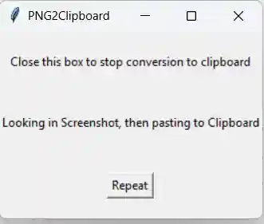

This is a quick and dirty utility mainly for Obsidian but should work on other .md files.

It will take and covert your last clip from Win11 Screenshots and put it on your clipboard to paste into Obsidian directly as an embedded webp filel

If you run it, it looks in %CurrentUser%\Screenshots for latest png files, turns it into webp 1080 @ 20 and then transfer this to your clipboard.  You can then paste the string directly into Obsidian.

The buffer goes away if you copy something else into the buffer, but the program puts up a dialog box to refresh.  

So, take another snip with the snipping tool, then hit the repeat button.

